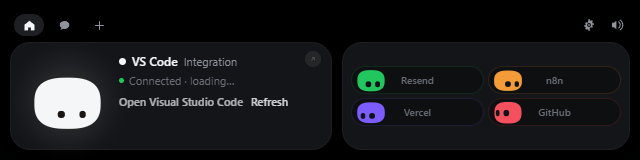

<div align="center">


# MoMo for Windows

**Mochi doesn't get a notch on a PC — so it lives at the top of your screen instead.**

Approve Claude Code permissions, watch your session work, drop a file, chat with your chosen online or local AI, keep an eye on your services — without leaving what you're doing.


</div>


---

## Install

Build a Windows installer with the instructions below, or use the manual
Windows workflow in GitHub Actions to generate installer artifacts. See
[PANDUAN-WINDOWS.md](../PANDUAN-WINDOWS.md) for the Indonesian guide. The installer
targets the current user; compiled installers are excluded from Git.

## Using it





| What you do | What happens |
|---|---|
| Move the mouse to the very top-centre of the screen | Mochi peeks out |
| Click the small island | It opens |
| Click Mochi | It gets annoyed. Three times in a row and it goes dizzy |
| Rest the pointer on Mochi for two seconds | Hearts |
| Drag a file onto the island | Mochi turns into a box, swallows it, then offers to answer questions about it |
| `Esc` | Closes the island |
| Tray icon | Open, Settings…, Pause, Quit |

Everything else happens on its own: a Claude Code permission request opens the
island with **Deny / Allow**, a finished session shows what it did, and
your integrations sit in the coloured pills next to Mochi.

## Local AI and desktop actions

Settings → **Local AI · offline** detects an Ollama model folder containing
`blobs` and `manifests`. Click **Start local AI**, choose a model, then **Add model
profile → Save changes**. MoMo owns a separate loopback server on port 11435.
The library is reused in place and is excluded from Git and installers. Ollama
and models must be installed or copied separately on other devices.

Enable **Computer actions** to let a tool-capable model open Notepad,
Calculator, Paint or File Explorer and create notes. Notes are saved under
`%LOCALAPPDATA%\MoMo\notes` and opened in Notepad. Linux uses available
equivalent apps and the default text editor. Chat displays actual tool results.

## Chat and keys

Open **Settings… → AI & models** to create model profiles for Claude, OpenAI /
ChatGPT, Gemini, other OpenAI-compatible providers, Ollama or LM Studio/local
OpenAI-compatible servers. Load the available models or enter a model ID, add
labeled API keys, and save. Key fallback follows the row order; model fallback
uses only explicitly selected profiles under **Fallback order**.

Saved key values stay in the **Windows Credential Manager** (Linux: **Secret
Service**). The interface shows masked fields for newly entered keys and only
the presence of stored keys. Existing Claude keys/preferences migrate without
requiring re-entry. Choose a saved profile from the chat toolbar; Stop cancels a
request. See [the AI setup guide](../docs/AI-MODELS.md) for local models,
fallback behavior and attachment support.

No telemetry. The only network requests MoMo makes are to the services you
configure yourself.

## Build it yourself

You need [Rust](https://rustup.rs), [Node 22](https://nodejs.org), and the
**MSVC build tools** (Visual Studio Build Tools with "Desktop development with
C++"). You also need WebView2; see the
[Windows prerequisites](https://v2.tauri.app/start/prerequisites/#windows).

```powershell
cd windows
npm ci
npm run tauri dev      # live-reloading development build
npm run pack           # builds the installer and drops it in windows/release/
```

`npm run dev` alone serves the front end in an ordinary browser, which is enough
to work on the island's looks. It also serves `dev/upload-preview.html`, which
replays the whole file-drop choreography on a loop — the one part of the UI that
otherwise needs a real drag from Explorer to see. Neither page ships in the app.

`npm run pack` creates one Windows version folder containing an installer with
WebView2 included and a README:

```
release/X.Y.Z/
  MoMo-X.Y.Z-Windows-x64-Setup.exe
  README.md
```

Installing is optional — `target/release/momo.exe` runs on its own. There is no
window in the taskbar and no console: the island at the top of the screen and the
Mochi in the notification area are the whole app, and Quit lives in its menu.

The 28 sounds are the macOS app's own files; they are never duplicated in this
folder. The path is declared once, in `SOUNDS_DIR` at the top of
`vite.config.ts` — when they move to `shared/sounds/`, change that one line.

The app icon and the tray icon are drawn in code, like Mochi itself:

```powershell
npm run icons          # regenerates src-tauri/icons from scripts/gen-icons.mjs
```

### Layout

```
windows/
  src/                 island front end (TypeScript, no framework)
    mochi/             Mochi and the launch greeting, in Canvas 2D
    island/            state machine, hooks, integrations
    views/             every island view
    settings/          the settings window
  src-tauri/           Rust backend: window, named pipe, Claude API, pollers
  hook/                momo-hook.exe, the Claude Code relay
  scripts/             icon generator
```

### Log

`%LOCALAPPDATA%\MoMo\momo.log` — hook events, permission decisions, poller
problems. It stays on your machine.

## What's different from the Mac version

- No notch, so the island lives at the top centre of the screen and retracts into
  the top edge instead of hiding in a notch.
- Permission approval works from **any** terminal; the Mac build only listens to
  VS Code sessions.
- Not in this version: sending a file by email, dragging Mochi onto a window to
  attach it as context, and jumping to a specific terminal window — "Open
  terminal" opens the working folder in VS Code when `code` is on your `PATH`.
- Cal.com shows the next bookings as a list rather than the Mac's calendar.

## Linux

The same app builds for Linux: everything that differs lives in
`src-tauri/src/platform/`, and the relay's transport in `hook/src/unix.rs`.

```bash
sudo apt install build-essential pkg-config \
  libwebkit2gtk-4.1-dev libgtk-layer-shell-dev libayatana-appindicator3-dev \
  librsvg2-dev libssl-dev libdbus-1-dev patchelf \
  gstreamer1.0-plugins-base gstreamer1.0-plugins-good
npm ci
npm run tauri dev      # live-reloading development build
npm run pack           # AppImage, .deb and .rpm in windows/release/
```

What changes on Linux:

- **The island** is a gtk-layer-shell overlay anchored to the top edge, over any
  top panel, on compositors that support it: COSMIC, KDE Plasma, Hyprland, Sway
  and other wlroots compositors. GNOME has no layer-shell, so there the island
  is a regular window. `MOMO_LAYER_SHELL=0` forces that mode anywhere.
- **Click-through** is the window's input region, kept equal to the island
  shape, so the compositor sends every other click to what is underneath.
- **Mochi's eyes** follow the pointer only while it is over the island: Wayland
  gives no app the cursor position anywhere else.
- **Claude Code hooks** go through `~/.local/share/momo/bin/momo-hook` and a
  Unix socket at `$XDG_RUNTIME_DIR/momo.sock`. Both ends check that the other
  runs as the same user.
- **Keys** live in the Secret Service (GNOME Keyring, KWallet).
- **Files**: preferences in `~/.config/momo/`, the log at
  `~/.local/share/momo/momo.log`.
- What the Windows build leaves out, this one does too: sending a file by
  email, dragging Mochi onto a window, and jumping to a specific terminal
  window — "Open terminal" opens the folder in VS Code.
